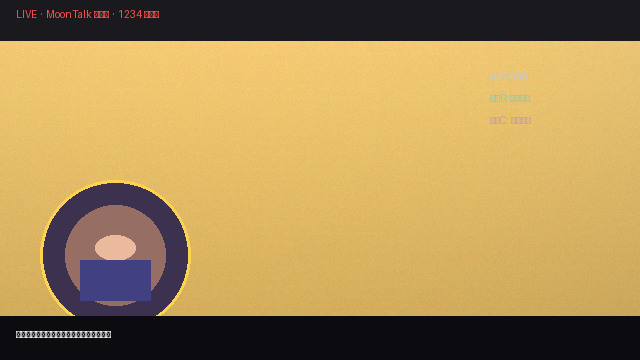

# moon-watermark

MoonBit 图像水印算法库：**可见水印**（文本 / 随机点阵 / Logo / 平铺）+ **不可见溯源水印**（LSB / DCT 域），提供 embed / extract / verify / trace API 与配置 JSON 序列化。内置中文点阵字形（Cjk16）与可扩展的 `GlyphProvider` 字形接口。定位为**通用图像水印基础库**——电商防搬运、素材预览防盗、图片版权确权、内部泄密溯源、API 图片追踪、直播防去重等场景开箱即用。

## 功能矩阵

### 可见水印（已实现）

| 类型 | API | 说明 |
| --- | --- | --- |
| 文本水印 | `RgbaImage::embed_text` + `TextConfig` | 内置 5×7 点阵字体（A-Z / 0-9 / 常用符号）+ **16×16 中文点阵（Cjk16，GB2312 一级字 3755 个）**；`TextConfig.font` 切换，支持缩放、透明度、定位、**角度旋转**（`angle`，45° 斜向防盗播水印）。⚠️ **Cjk16 只含汉字**：含数字/字母/符号的文本会渲染为空白，请用 `ascii5x7`，或 `BitmapFont::with_cjk16(extra)` 在汉字基础上补充品牌字形/ASCII |
| 随机点阵水印 | `RgbaImage::embed_dots` + `DotConfig` | 确定性 PRNG（xorshift64）按网格落点；**同一 seed 完全可复现 → 可提取、可溯源** |
| Logo 水印 | `RgbaImage::embed_logo` | 任意 RGBA 图叠加，支持透明 PNG |
| 平铺水印 | `RgbaImage::embed_tiled` + `TiledConfig` | 全幅网格平铺，防截屏/盗摄 |

### 不可见水印（已实现）

| API | 说明 |
| --- | --- |
| `RgbaImage::embed_invisible` + `extract_invisible` | LSB 逐位嵌入（RGB 通道各 1 bit/像素）；key 派生 keystream 整体混淆，错误 key 在 magic 校验处被拒绝；容量 = `宽×高×3/8` 字节 |
| `RgbaImage::embed_dct` + `extract_dct` | **DCT 域**：亮度域（BT.601 Y）8×8 分块 DCT-II，中频系数 (4,1) QIM 嵌入（与 JPEG 亮度分量一致，抗色度量化）；`delta` 默认 24，**JPEG 重压可提取**（自然纹理 q85 默认通过；强压缩 q60 建议 `delta=48`）；容量 = 完整 8×8 块数/8 字节 |

### 提取、验证与溯源（已实现）

| API | 说明 |
| --- | --- |
| `extract_dots` | 用同一 `DotConfig` 复现点位置，统计深色命中率（0.0~1.0） |
| `verify_dots` | 命中率 ≥ 阈值（默认 0.9）判定水印存在 |
| `verify_invisible` | LSB 水印 magic 校验 |
| `trace_dots` | 对候选 `DotConfig` 数组溯源：返回命中率最高者索引（≥ 阈值）；分发场景为每个接收者分配独立 seed，泄漏即锁定接收者 |
| `extract_dct` | DCT 水印 magic "MD" + 长度校验；JPEG/PNG 往返均可提取；`delta` 可选参数须与嵌入侧一致 |
| `detect_lsb` / `detect_dct` | **盲检测**：不依赖 key/delta，仅读帧头 magic + 长度合理性判断"是否被标记"——溯源第一问（拿到疑似泄漏帧先判断，再决定深入提取）；注意带 key 混淆的 LSB 帧无 key 检不出（文档化语义） |
| `RgbaImage::lsb_capacity` / `dct_capacity` | 查询各通道可用 payload 容量（字节，扣除帧头），嵌入前规划"这条 payload 走 LSB 还是 DCT" |
| `RgbaImage::embed_all` + `EmbedOptions` | **组合嵌入**：一次调用按配置叠加文本/点阵/LSB/DCT（可选通道），面向逐帧应用（直播贴片）复用；LSB 与 DCT 互斥返回 `Err`，不静默降级 |

### 图像 IO（基于 `mizchi/image`）

`decode_png` / `encode_png` / `decode_jpeg` / `encode_jpeg` / `resize` / `crop` / `rotate`（任意角度，逆映射最近邻；90/180/270 精确搬运）

### 不可见性度量（已实现）

| API | 说明 |
| --- | --- |
| `psnr(orig, marked)` | 峰值信噪比（dB），量化嵌入前后可感知差异；尺寸不一致返回 `None` |

实测（128×128 纹理测试图）：**LSB 不可见水印 PSNR 76.98dB**（>40dB，肉眼不可察）· **DCT 域水印 PSNR 50.9dB（`delta=24`）/ 45.3dB（`delta=48`）**（亮度域嵌入，均 >40dB 肉眼不可察）· **点阵可见水印 25.07dB**（明显可见，起威慑作用）。

### 配置持久化（已实现）

`text_config_to_json/from_json`、`dot_config_to_json/from_json`、`tiled_config_to_json/from_json`（core `@json`，seed 以 Number 表示）

### 典型应用场景

四种能力可按需组合，覆盖图片保护的常见诉求：

| 场景 | 推荐能力 | 机制 |
| --- | --- | --- |
| 电商主图 / 详情页防同行盗图 | 可见（Logo / 文本） | 店铺名 + 商品信息角落或平铺，搬运必留痕 |
| 素材 / 图库预览防盗 | 可见 + 不可见 | 预览图盖半透明水印；样图嵌客户 ID |
| 内部设计稿 / 文档截图泄密溯源 | `trace_dots` | 每个员工 / 供应商独立 seed，外泄即定位 |
| 图片版权确权（摄影 / 插画 / 设计） | LSB / DCT 不可见 | 创作时嵌入作者 ID + 时间，维权时提取作证；经压缩分发时选 DCT |
| API 图片 / 头像接口追踪 | LSB / DCT 不可见 | 按调用方嵌入 ID，识别爬虫、盗链、二次分发；CDN 压缩链路选 DCT |
| 广告 / 营销素材渠道追踪 | `trace_dots` | 不同投放渠道不同 seed，泄漏渠道一测便知 |
| 社交 / UGC 平台防二创搬运 | 平铺 | 全幅网格水印，截图翻拍仍可见 |
| 直播 / 视频切片防搬运 | 可见 + 点阵（动态） | 平台名 + 时间戳 + 观众 ID，配合 OBS 浏览器源落地 |
| 报告 / 报表 / 合同截图防外泄 | 平铺 + 文本 | 公司名 + 部门，截屏即留痕 |
| 取证存证 | 文本 + LSB | 时间 + 拍摄者身份，形成证据链 |

选型速记：**要看得见震慑 → 可见水印**；**要看不见取证 → LSB**；**图片要过 JPEG/压缩链 → DCT**；**要出事能定位人 → 按接收者分发 seed 走 `trace_dots`**。

## 安装

```bash
moon add yuzhiblue/moon-watermark
```

## Quick Start

完整可运行示例见 `cmd/main/main.mbt`（`moon run cmd/main`）。库外使用时需引入依赖与模块：

```moonbit
// 依赖：moon add yuzhiblue/moon-watermark
// import：
//   import "yuzhiblue/moon-watermark" @lib
//   import "moonbitlang/core/encoding/utf8" @utf8   // 中文 payload 转 UTF-8 字节
//   import "moonbitlang/core/bytes" @bytes           // Bytes 切片（decode_png 结果）
//
// 注意：String::to_bytes 在 MoonBit 中返回 UTF-16，不可直接作 payload，
// 必须经 @utf8.encode 转码（含 ASCII：@utf8.encode("UID-001")）。

// 1. 生成测试图（或 decode_png 解码真实图片）
let img = @lib.RgbaImage::new(320, 240, 0xFFFF_FFFF)

// 2. 组合嵌入：文本（右下角 45° 斜向）+ 点阵（seed=接收者 ID）+ LSB（观众 ID）
//    embed_all 返回 Result（任一通道失败即 Err，不产生半成品）
let tcfg = @lib.TextConfig::new("LIVE", 8, 200, 2, 0.6, 0xFF00_00FF, angle=45.0)
let dcfg = @lib.DotConfig::default()
let opts : @lib.EmbedOptions = {
  text_cfg: Some(tcfg),
  dot_cfg: Some(dcfg),
  lsb_payload: Some(@utf8.encode("UID-001")),
  lsb_key: Some(42L),
  dct_payload: None,
  dct_delta: 24,
}
let marked = match img.embed_all(opts) {
  Ok(m) => m
  Err(e) => { println("embed failed: \{e}"); abort() }
}

// 3. 盲检测 → 提取验证（溯源链路：先 detect 再 extract）
if @lib.detect_lsb(marked) { println("marked ✓") }
let back = @lib.decode_png(marked.encode_png().unwrap_or(Bytes::new())).unwrap_or(img)
let rate = @lib.extract_dots(back, dcfg)   // ≥0.9 判定点阵水印存在
```

## 命令行工具（文件模式 CLI）

`cmd/main` 提供文件 IO 的 CLI（v0.1.7 起，基于 `moonbitlang/x/fs` 社区包）：

```bash
# 嵌入：文本 + 点阵 + LSB 不可见水印，输出 PNG/JPEG（按扩展名）
moon run cmd/main -- embed in.png out.png --text "LIVE 2026-10-03" --font cjk16 --lsb "UID-001" --key 42

# 只嵌 DCT 域水印（抗 JPEG），delta 加大可抗更强压缩
moon run cmd/main -- embed in.jpg out.jpg --dct "UID-001" --delta 48

# 验证
moon run cmd/main -- verify-dots out.png            # 点阵命中率
moon run cmd/main -- verify-lsb out.png --key 42    # LSB 提取（key 必须与嵌入一致）
moon run cmd/main -- verify-dct out.png --delta 48  # DCT 提取（delta 必须与嵌入一致）

# 无参数 = 内存演示（原 Quick Start 示例）
moon run cmd/main
```

要点：

- **`--lsb` 与 `--dct` 互斥**：DCT 重写亮度分量会破坏 LSB，同时指定时 CLI 保留 LSB、跳过 DCT 并警告。
- **嵌入与提取的 `--delta` 必须一致**：DCT 提取按同一量化网格判定奇偶，两侧不一致会全部错位。
- **`--opacity` 同时作用于文本与点阵水印**；文本默认放在**右下角**（避开不可见水印的左上角头部区），默认文本为 `LIVE`。
- **payload 按 UTF-8 编码**：`String::to_bytes` 在 MoonBit 中返回 UTF-16，CLI 已用 `@encoding/utf8` 统一转码（含中文 payload）。
- 水印组合顺序：可见水印（文本/点阵/Logo）先嵌、不可见水印最后（避免覆盖其左上角头部区——可见水印请避开头部区位置）。**`embed_all` 中 LSB 与 DCT 互斥返回 Err**（库 API 不静默降级；CLI 因保留 LSB 的取舍是跳过 DCT 并警告，两者策略不同）。

## 演示

嵌入前后对比（2×2：**左上原图 → 右上 LSB 不可见水印 → 左下可见水印 → 右下差异标记**，红色点为 LSB 实际改动位置——512×288 图仅 28 px，占比 0.02%，肉眼不可察）：


溯源演示（三位接收者持不同 seed，泄漏帧经 `trace_dots` 锁定接收者 C）：


鲁棒性矩阵可视化（数据来自 `robustness_wbtest.mbt` 实测）：


## 真实场景链路演示（E2E）

以一张模拟直播画面（`assets/live_frame.png`）跑通**贴片嵌入 → JPEG 转码 → 溯源验证**全链路，覆盖"直播去重 + 防盗播溯源"真实用法：

```bash
moon run cmd/e2e                 # 默认用 assets/live_frame.png
moon run cmd/e2e -- your.png     # 任意图片跑同一链路
```

链路与实测输出（`moon run cmd/e2e`，v0.1.10）：

1. **贴片三件套嵌入**：可见文本 `LIVE 2026-10-04 UID-00421`（中下部字幕条上方，防盗播震慑；ASCII 文本走 `ascii5x7`——`Cjk16` 只含汉字、混合文本会空白）+ 点阵 `seed=421`（观众 ID，溯源用）+ DCT `UID-00421`（抗平台转码的取证载体）；
2. **模拟平台转码**：`encode_jpeg(85)`（平台切片/分发必经的 JPEG 重压链路）→ 读回；
3. **溯源验证**：
   - `extract_dots` 命中率 `1` → PASS（点阵在 JPEG q85 后完整保留）；
   - `extract_dct` 提取 UID `UID-00421` → 定位观众 421（DCT 域水印在亮度域嵌入，与 JPEG 量化域一致，转码后仍可提取）；
   - `trace_dots` 对候选 [seed 1, 2, 421] 溯源 → 命中索引 2 → **锁定观众 C**。

 → 

转码产物 `docs/demo/e2e_jpeg.jpg` 即为"泄漏帧"，可直接对其重复上述验证。

## 性能基准（实测）

`cmd/bench` 可执行基准（core `@bench.single_bench`，10 样本自适应批量，中位数）：

```bash
moon run cmd/bench            # 320×240 … 1920×1080 四档
moon run cmd/bench -- 640 360 # 指定尺寸
```

实测（v0.1.10，MoonBit 0.10.14 native，渐变纹理测试图，payload 8 字节）：

| 操作 | 320×240 | 640×360 | 1280×720 | 1920×1080 |
| --- | --- | --- | --- | --- |
| `embed_text`（cjk16 右下角） | 85 µs | 85 µs | 85 µs | 110 µs |
| `embed_dots`（128 点） | 5.5 µs | 5.6 µs | 5.6 µs | 5.6 µs |
| `embed_invisible`（LSB） | 3.5 µs | 3.5 µs | 3.5 µs | 3.5 µs |
| `embed_dct`（delta=24） | 111 ms | 112 ms | 110 ms | 110 ms |
| `embed_all`（文本+点阵+LSB） | 95 µs | 98 µs | 94 µs | 118 µs |
| `encode_png` | 22 ms | 60 ms | 230 ms | 514 ms |

要点（与设计目标一致）：

- **嵌入成本与画面尺寸基本无关、与 payload 长度线性**：DCT/LSB 只改写 payload 所需区域（8B payload = 96 个 8×8 块 / 96 bit = 32 像素），文本只渲染文本区域——贴片工坊逐帧调用 `embed_all` 的成本稳定在 ~100 µs 级，不随分辨率放大；
- **DCT 是最重路径**（~110 ms，全 DCT-II 逐块变换，wasm 解释模式）；逐帧实时流建议走 LSB/点阵组合，DCT 用于关键帧取证；
- **编码 IO 随尺寸线性**（PNG 1080p ~0.5 s），生产链路建议编码走并行或选择 JPEG（`encode_jpeg(85)` 远快于 PNG，且 DCT 水印本就抗 JPEG）。

## 鲁棒性测试矩阵（实测）

`moon test` 的 `robustness_wbtest.mbt` 实测数据（128×128 测试图，`DotConfig::default()`，density=0.05）：

> 符号含义：**✅ 通过/可提取** · **❌ 该攻击下提取失败**（水印特性，见说明列）· **⚠️ 已知边界**（点阵在纯裁剪下失效）。❌ 不是功能缺失——每种水印各有适用链路，表格与说明列给出替代方案。

| 攻击 | 点阵水印命中率 | LSB 不可见水印 | DCT 域水印 | 说明 |
| --- | --- | --- | --- | --- |
| PNG 无损往返 | 1.0 ✅ | 可提取 ✅ | 可提取 ✅ | PNG 是 LSB 的可靠载体，DCT 亮度域无损往返亦稳定 |
| JPEG q60 重压 | 1.0 ✅ | 提取失败 ❌ | 可提取 ✅（`delta=48`） | 深色点高对比经 JPEG 保留；LSB 被量化破坏；DCT 在亮度域嵌入、与 JPEG 量化域一致（delta 越大越抗压，默认 24 适合 PNG 工作流与自然纹理 q85，重压缩建议 `--delta 48`） |
| 缩放至 1/2（Nearest） | 1.0 ✅ | 提取失败 ❌ | 提取失败 ❌ | 点阵：归一化网格 + 偶数对齐 + 邻域容差（v0.1.2 起）。LSB/DCT：像素坐标随缩放错位 → 失败；需抗几何攻击的不可见水印属后续规划 |
| 裁剪半幅 | 0.0 ⚠️ | 可提取 ✅ | 提取失败 ❌ | 点阵：归一化网格按新尺寸采样、而裁剪内容是原坐标像素 → 错位（已知边界）。LSB：裁剪保留原坐标像素 → 可提取。DCT：分块按原坐标对齐，裁剪错位。**纯裁剪攻击建议配合 LSB** |

## 设计说明

- **颜色打包**：`0xRRGGBBAA`。MoonBit `Int` 为 32 位有符号，`0xFFFF_FFFF` 等高位字面量会表示为负数——位运算完全等价，无需担心；推荐用 `(r << 16) | (g << 8) | b | (a << 24)` 构造颜色。
- **确定性**：点阵水印完全由 `DotConfig`（含 seed）决定，这是提取与溯源的基础。
- **归一化网格**：点阵落点按比例坐标（单元 = 图宽 8%），点坐标对齐偶数像素，因此缩放后仍可提取；代价是纯裁剪会因参考尺寸改变而错位（见鲁棒性矩阵）。
- **PNG 无损往返**：PNG 编码/解码不损失 LSB 信息，是不可见水印的可靠载体（见鲁棒性矩阵）。
- **DCT 域设计**：**亮度域（BT.601 Y=0.299R+0.587G+0.114B）** 8×8 分块 DCT-II + 中频系数 (4,1) QIM 量化嵌入，`delta` 默认 24（越大越抗 JPEG、可见性略升）。亮度域与 JPEG 编码的 Y 分量一致，DCT 系数才能经受色度量化往返（在 G 通道嵌入会被 YCbCr 色度量化破坏——v0.1.7 起改为亮度域）。注意：**纯白/纯黑等饱和区域**的正扰动会被像素 clamp 截断（系数跌到 Δ/2 边界），鲁棒性弱——真实图像纹理区不受影响；若已知图片大面积饱和，调大 `delta` 或改用 LSB。
- **安全边界**：LSB 与 DCT 水印提供**隐蔽性与 JPEG 鲁棒性**，不提供强加密/抗伪造——嵌入格式（magic、布局、系数位置）为公开知识，知道算法者可提取或覆盖水印；需要鉴权/防伪时，依赖持有方按 secret 管理嵌入参数（LSB 的 `key`、DCT 的 `delta`），并在上层做密钥分发与吊销。
- **embed_\* 统一返回 `Result[RgbaImage, String]`**（v0.1.9 起）：可见水印当前无失败路径（Ok 恒成立），不可见水印容量超限返回 Err；调用方统一一种错误处理模式。`extract_*` 返回 `Bytes?`（提取失败 None），`extract_dots` 返回命中率（0.0~1.0）。
- **旋转实现**：逆映射最近邻 + 像素中心坐标（`round` 定位源像素），90/180/270 为精确像素搬运；源范围外像素透明。`embed_text` 对 >512 字符返回 Err——超长文本旋转会分配 GB 级中间位图（资源保护，见「非目标」）。
- **GlyphProvider 字形接口**：`trait GlyphProvider { cell_width / cell_height / glyph }`，内置 `Ascii5x7`（拉丁，A-Z/0-9/常用符号）与 `Cjk16`（16×16 中文点阵，**GB2312 一级字 3755 个**，Noto CJK 生成；未收录的字形返回 `None` → 渲染为空白）。⚠️ **Cjk16 不含 ASCII**：含数字/字母的文本水印用 `ascii5x7`，或 `BitmapFont::with_cjk16(extra)` 补字（如品牌名、`LIVE` 等英文标识）。自定义字形：实现 trait 后走 `render_text_with`，或用 `BitmapFont::new(w, h, pairs)` 一行构造自带字表；亦可经 `TextConfig.font`（JSON 兼容）切换内置字体。

## 非目标（明确边界）

- **不提供强加密/防伪认证**：LSB/DCT 提供隐蔽性与 JPEG 鲁棒性；鉴权、防伪、密钥分发与吊销由上层负责（见「设计说明·安全边界」）。
- **不可见水印不抗几何攻击**（缩放/裁剪后提取失败是水印原理边界，非 bug）：可见点阵水印抗缩放、LSB 抗裁剪已覆盖主流链路（见鲁棒性矩阵）。
- **不做视频/流式封装**：逐帧应用（如直播贴片）在上层组合本库能力——`embed_all` 即面向逐帧复用设计。
- **载体格式仅 PNG/JPEG**：GIF/WebP/AVIF/BMP 不在计划内；多格式需求请在调用方转码后嵌入。
- **不做超长文本水印**：`embed_text` 对 >512 字符返回 Err（旋转中间位图可至 GB 级内存，边界测试固化）。

## 状态

- **当前**：v0.1.9 已发布（mooncakes，https://mooncakes.io/docs/yuzhiblue/moon-watermark）；v0.1.10 在途（性能基准 `cmd/bench`、真实场景 E2E `cmd/e2e`、`EmbedOptions` 外部可构造）。97 测试全过（含边界输入矩阵、盲检测、组合嵌入、旋转回归），`moon check --deny-warn` 零警告，CI 绿。

## License

Apache-2.0
