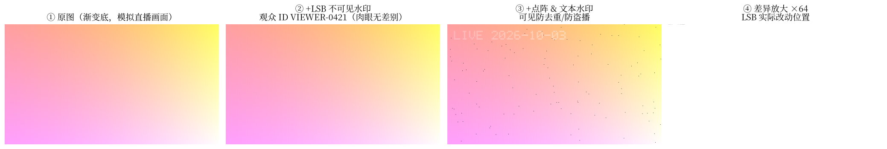
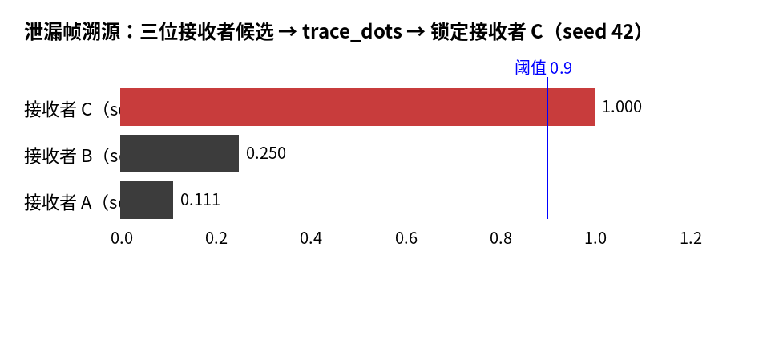
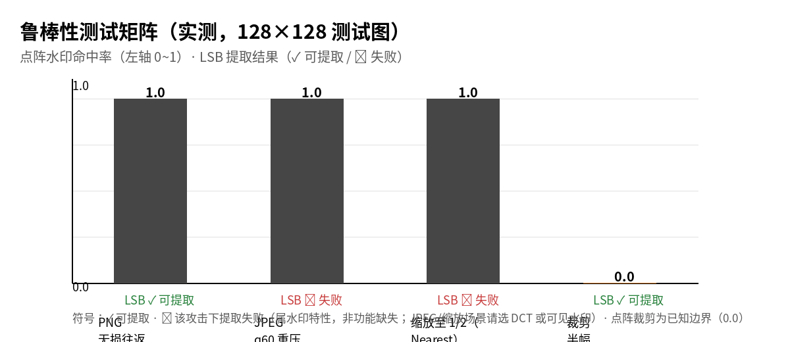

# moon-watermark

MoonBit 图像水印算法库：**可见水印**（文本 / 随机点阵 / Logo / 平铺）+ **不可见溯源水印**（LSB / DCT 域），提供 embed / extract / verify / trace API 与配置 JSON 序列化。内置中文点阵字形（Cjk16）与可扩展的 `GlyphProvider` 字形接口。定位为**通用图像水印基础库**——电商防搬运、素材预览防盗、图片版权确权、内部泄密溯源、API 图片追踪、直播防去重等场景开箱即用。

## 功能矩阵

### 可见水印（已实现）

| 类型 | API | 说明 |
| --- | --- | --- |
| 文本水印 | `RgbaImage::embed_text` + `TextConfig` | 内置 5×7 点阵字体（A-Z / 0-9 / 常用符号）+ **16×16 中文点阵（Cjk16，GB2312 一级字 3755 个）**；`TextConfig.font` 切换，支持缩放、透明度、定位 |
| 随机点阵水印 | `RgbaImage::embed_dots` + `DotConfig` | 确定性 PRNG（xorshift64）按网格落点；**同一 seed 完全可复现 → 可提取、可溯源** |
| Logo 水印 | `RgbaImage::embed_logo` | 任意 RGBA 图叠加，支持透明 PNG |
| 平铺水印 | `RgbaImage::embed_tiled` + `TiledConfig` | 全幅网格平铺，防截屏/盗摄 |

### 不可见水印（已实现）

| API | 说明 |
| --- | --- |
| `RgbaImage::embed_invisible` + `extract_invisible` | LSB 逐位嵌入（RGB 通道各 1 bit/像素）；key 派生 keystream 整体混淆，错误 key 在 magic 校验处被拒绝；容量 = `宽×高×3/8` 字节 |
| `RgbaImage::embed_dct` + `extract_dct` | **DCT 域**：8×8 分块 DCT-II，中频系数 (4,1) QIM 嵌入；**JPEG 重压后可提取**（q60 实测通过）；容量 = 完整 8×8 块数/8 字节 |

### 提取、验证与溯源（已实现）

| API | 说明 |
| --- | --- |
| `extract_dots` | 用同一 `DotConfig` 复现点位置，统计深色命中率（0.0~1.0） |
| `verify_dots` | 命中率 ≥ 阈值（默认 0.9）判定水印存在 |
| `verify_invisible` | LSB 水印 magic 校验 |
| `trace_dots` | 对候选 `DotConfig` 数组溯源：返回命中率最高者索引（≥ 阈值）；分发场景为每个接收者分配独立 seed，泄漏即锁定接收者 |
| `extract_dct` | DCT 水印 magic "MD" + 长度校验；JPEG/PNG 往返均可提取 |

### 图像 IO（基于 `mizchi/image`）

`decode_png` / `encode_png` / `decode_jpeg` / `encode_jpeg` / `resize` / `crop`

### 不可见性度量（已实现）

| API | 说明 |
| --- | --- |
| `psnr(orig, marked)` | 峰值信噪比（dB），量化嵌入前后可感知差异；尺寸不一致返回 `None` |

实测（128×128 测试图）：**LSB 不可见水印 PSNR 76.98dB**（>40dB，肉眼不可察）· **DCT 域水印 PSNR ≈35dB**（JPEG 鲁棒性的代价，仍显著高于可见水印）· **点阵可见水印 25.07dB**（明显可见，起威慑作用）。

### 配置持久化（已实现）

`text_config_to_json/from_json`、`dot_config_to_json/from_json`、`tiled_config_to_json/from_json`（core `@json`，seed 以 Number 表示）

### 典型应用场景

四种能力可按需组合，覆盖图片保护的常见诉求：

| 场景 | 推荐能力 | 机制 |
| --- | --- | --- |
| 电商主图 / 详情页防同行盗图 | 可见（Logo / 文本） | 店铺名 + 商品信息角落或平铺，搬运必留痕 |
| 素材 / 图库预览防盗 | 可见 + 不可见 | 预览图盖半透明水印；样图嵌客户 ID |
| 内部设计稿 / 文档截图泄密溯源 | `trace_dots` | 每个员工 / 供应商独立 seed，外泄即定位 |
| 图片版权确权（摄影 / 插画 / 设计） | LSB / DCT 不可见 | 创作时嵌入作者 ID + 时间，维权时提取作证；经压缩分发时选 DCT |
| API 图片 / 头像接口追踪 | LSB / DCT 不可见 | 按调用方嵌入 ID，识别爬虫、盗链、二次分发；CDN 压缩链路选 DCT |
| 广告 / 营销素材渠道追踪 | `trace_dots` | 不同投放渠道不同 seed，泄漏渠道一测便知 |
| 社交 / UGC 平台防二创搬运 | 平铺 | 全幅网格水印，截图翻拍仍可见 |
| 直播 / 视频切片防搬运 | 可见 + 点阵（动态） | 平台名 + 时间戳 + 观众 ID，配合 OBS 浏览器源落地 |
| 报告 / 报表 / 合同截图防外泄 | 平铺 + 文本 | 公司名 + 部门，截屏即留痕 |
| 取证存证 | 文本 + LSB | 时间 + 拍摄者身份，形成证据链 |

选型速记：**要看得见震慑 → 可见水印**；**要看不见取证 → LSB**；**图片要过 JPEG/压缩链 → DCT**；**要出事能定位人 → 按接收者分发 seed 走 `trace_dots`**。

## 安装

```bash
moon add yuzhiblue/moon-watermark
```

## Quick Start

完整可运行示例见 `cmd/main/main.mbt`（`moon run cmd/main`）：

```moonbit
// 1. 生成测试图（或 decode_png 解码真实图片）
let img = @lib.RgbaImage::new(320, 240, 0xFFFF_FFFF)

// 2. 文本水印：平台名 + 时间戳（直播贴片场景）
let tcfg = @lib.TextConfig::new("LIVE 2026-10-03", 8, 8, 2, 0.6, 0xFF00_00FF)
let _ = img.embed_text(tcfg)

// 3. 点阵溯源水印：seed = 观众/接收者 ID
let dcfg = @lib.DotConfig::default()
let _ = img.embed_dots(dcfg)

// 4. 编码 → 解码 → 提取验证
let png = img.encode_png()
let back = @lib.decode_png(png.unwrap()).unwrap()
let rate = @lib.extract_dots(back, dcfg)   // ≥0.9 判定水印存在
```

## 演示

嵌入前后对比（2×2：**左上原图 → 右上 LSB 不可见水印 → 左下可见水印 → 右下差异标记**，红色点为 LSB 实际改动位置——512×288 图仅 28 px，占比 0.02%，肉眼不可察）：



溯源演示（三位接收者持不同 seed，泄漏帧经 `trace_dots` 锁定接收者 C）：



鲁棒性矩阵可视化（数据来自 `robustness_wbtest.mbt` 实测）：



## 鲁棒性测试矩阵（实测）

`moon test` 的 `robustness_wbtest.mbt` 实测数据（128×128 测试图，`DotConfig::default()`，density=0.05）：

> 符号含义：**✅ 通过/可提取** · **❌ 该攻击下提取失败**（水印特性，见说明列）· **⚠️ 已知边界**（点阵在纯裁剪下失效）。❌ 不是功能缺失——每种水印各有适用链路，表格与说明列给出替代方案。

| 攻击 | 点阵水印命中率 | LSB 不可见水印 | 说明 |
| --- | --- | --- | --- |
| PNG 无损往返 | 1.0 ✅ | 可提取 ✅ | LSB 的可靠载体 |
| JPEG q60 重压 | 1.0 ✅ | 提取失败 ❌ | 深色点高对比经 JPEG 保留；LSB 被量化破坏 → JPEG 场景用 **DCT 域水印**（`embed_dct`/`extract_dct`，q60 往返提取实测通过） |
| 缩放至 1/2（Nearest） | 1.0 ✅ | 提取失败 ❌ | 点阵：归一化网格 + 偶数对齐 + 邻域容差（v0.1.2 起）。LSB：像素坐标随缩放错位 → 失败；需抗缩放的不可见水印属后续规划 |
| 裁剪半幅 | 0.0 ⚠️ | 可提取 ✅ | 点阵：归一化网格按新尺寸采样、而裁剪内容是原坐标像素 → 错位（已知边界）。LSB：裁剪保留原坐标像素，水印位未受损 → 可提取。**纯裁剪攻击建议配合 LSB** |

## 设计说明

- **颜色打包**：`0xRRGGBBAA`。MoonBit `Int` 为 32 位有符号，`0xFFFF_FFFF` 等高位字面量会表示为负数——位运算完全等价，无需担心；推荐用 `(r << 16) | (g << 8) | b | (a << 24)` 构造颜色。
- **确定性**：点阵水印完全由 `DotConfig`（含 seed）决定，这是提取与溯源的基础。
- **归一化网格**：点阵落点按比例坐标（单元 = 图宽 8%），点坐标对齐偶数像素，因此缩放后仍可提取；代价是纯裁剪会因参考尺寸改变而错位（见鲁棒性矩阵）。
- **PNG 无损往返**：PNG 编码/解码不损失 LSB 信息，是不可见水印的可靠载体（见鲁棒性矩阵）。
- **DCT 域设计**：8×8 分块 DCT-II + 中频系数 (4,1) QIM 量化嵌入，`delta` 默认 24（越大越抗 JPEG、可见性略升）。注意：**纯白/纯黑等饱和区域**的正扰动会被像素 clamp 截断（系数跌到 Δ/2 边界），鲁棒性弱——真实图像纹理区不受影响；若已知图片大面积饱和，调大 `delta` 或改用 LSB。
- **安全边界**：LSB 与 DCT 水印提供**隐蔽性与 JPEG 鲁棒性**，不提供强加密/抗伪造——嵌入格式（magic、布局、系数位置）为公开知识，知道算法者可提取或覆盖水印；需要鉴权/防伪时，依赖持有方按 secret 管理嵌入参数（LSB 的 `key`、DCT 的 `delta`），并在上层做密钥分发与吊销。
- **GlyphProvider 字形接口**：`trait GlyphProvider { cell_width / cell_height / glyph }`，内置 `Ascii5x7`（拉丁）与 `Cjk16`（16×16 中文点阵，**GB2312 一级字 3755 个**，Noto CJK 生成；未收录的生僻字跳过）。自定义字形：实现 trait 后走 `render_text_with`，或用 `BitmapFont::new(w, h, pairs)` 一行构造自带字表、`BitmapFont::with_cjk16(extra)` 在内置字集上补充生僻字/品牌字形；亦可经 `TextConfig.font`（JSON 兼容）切换内置字体。

## 状态

- **当前**：v0.1.4 已发布（mooncakes），67 测试全过，CI 绿。
- **下一步**：直播贴片工坊应用（OBS / 直播伴侣浏览器源）复用本库；CLI（core 暂无进程参数与文件 IO，WASI 社区包接入会改变 target 配置）推迟至 v0.2 native。

## License

Apache-2.0
